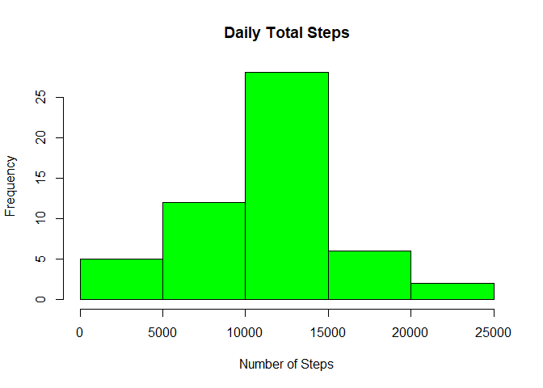
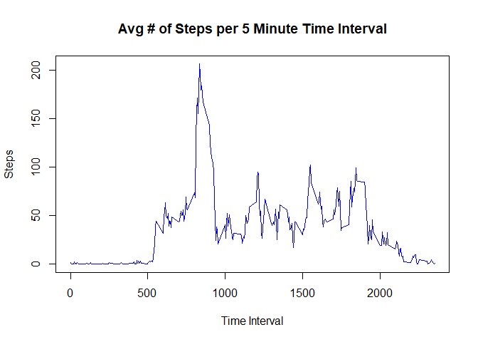
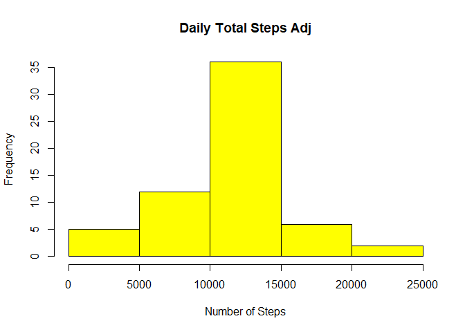
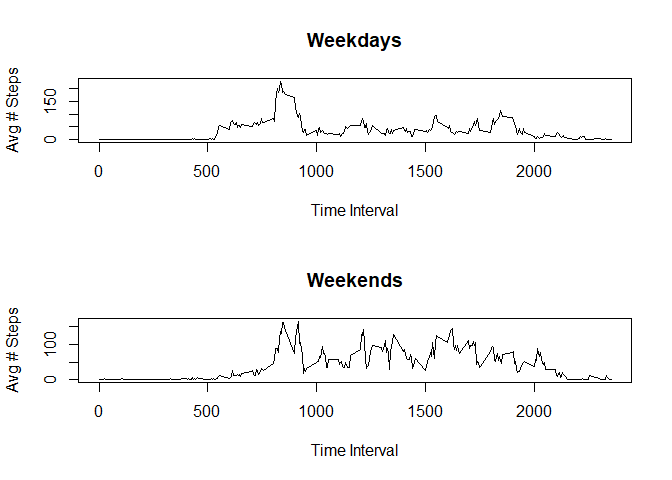

G.Surplus 12/21/2020

## Set knitr default options

```r
knitr::opts_chunk$set(echo = TRUE, results = "show")
```

## Loading and preprocessing the data

```r
filepath<-paste("D:/GregsStuff/Learning/DataScience/R/ReproducibleResearch/",
                   "PeerAssignment1/RepData_PeerAssessment1",sep="")
setwd(filepath)
library(tidyverse)
activityData <- read.csv("activity.csv")
activityDataMissRem<-activityData[is.na(activityData$steps)==FALSE,]
```

## What is mean total number of steps taken per day?
Calculating the total number of steps each day for use in a histogram.

```r
dailySteps<-setNames(
  aggregate(activityDataMissRem$steps, 
            list(activityDataMissRem$date), sum),c("date","numSteps"))
```

Here is a histogram of the total number of steps each day

```r
hist(dailySteps$numSteps, main="Daily Total Steps", 
     xlab="Number of Steps", col="green")
```

<!-- -->

The mean number of daily steps was found to be: 10766.19 and the
median: 10765


```r
mean(dailySteps$numSteps)
```

```
## [1] 10766.19
```

```r
median(dailySteps$numSteps)
```

```
## [1] 10765
```

## What is the average daily activity pattern?
Here I computed the average number of steps per five minute interval across all days

```r
avgStepsPer5Min<-setNames(
  aggregate(activityDataMissRem$steps, 
            list(activityDataMissRem$interval), mean),
  c("timeInterval","numSteps"))
```

I then produced a time series plot of the 5-minute interval and the average
number of steps taken, averaged across all days.


```r
plot(avgStepsPer5Min$timeInterval, avgStepsPer5Min$numSteps, type="l", 
     main="Avg # of Steps per 5 Minute Time Interval", xlab="Time Interval", 
     ylab="Steps", col="blue")
```

<!-- -->

Across all days, time interval 835 contains the maximum number of average steps

```r
avgStepsPer5Min[avgStepsPer5Min$numSteps == max(avgStepsPer5Min$numSteps),]
```

```
##     timeInterval numSteps
## 104          835 206.1698
```

## Imputing missing values
There are 2304 rows with missing values

```r
nrow(activityData[is.na(activityData)==TRUE,])
```

```
## [1] 2304
```

I have decided to fill in the missing values by taking the mean across all
days for the given 5 minute interval.  I have created a new dataset which
contains a new column called, *adjSteps* whose field contains the number
of steps for that interval when available or the mean # of steps across
all days for that interval if the steps field is missing.

```r
activityDataAdj<-setNames(left_join(activityData, avgStepsPer5Min, 
                     c("interval" ="timeInterval")),
                     c(colnames(activityData),"avgIntervalSteps"))
activityDataAdj<-setNames(
  cbind(activityDataAdj,
        case_when(
          is.na(activityDataAdj$steps) == TRUE ~
            as.integer(round(activityDataAdj$avgIntervalSteps),0),
          TRUE ~ activityDataAdj$steps)), 
  c(colnames(activityDataAdj),"adjSteps"))
```

Here I have created a new dataframe called *dailyStepsAdj* which will use
the new *adjSteps* field from *activityDataAdj*

```r
dailyStepsAdj<-setNames(
  aggregate(activityDataAdj$adjSteps, list(activityDataAdj$date), sum),
  c("date","numSteps"))
```

Here is a histogram of the total daily steps with the missing values
filled in.

```r
hist(dailyStepsAdj$numSteps, main="Daily Total Steps Adj", 
     xlab="Number of Steps", col="yellow")
```

<!-- -->

With the missing values filled in, the mean is now: 10765.64 and the 
median is: 10762

```r
mean(dailyStepsAdj$numSteps)
```

```
## [1] 10765.64
```

```r
median(dailyStepsAdj$numSteps)
```

```
## [1] 10762
```

The mean has changed from: 10766.19 to 10765.64.  The median has changed from: 
10765 to 10762.  These values have changed slightly.  Comparing the graphs
show that for the histogram with the missing values filled in, the 10000-15000
group has increased.

## Are there differences in activity patterns between weekdays and weekends?
Here I have created two vectors.  One for weekday and one for weekend.  I have
copied the *activityDataAdj* dataframe into a new dataframe called:
*activityDataAdjWithWeekPart* and added the column *dayOfWeek*

```r
weekday<-c("Monday","Tuesday","Wednesday","Thursday","Friday")
weekend<-c("Saturday","Sunday")
activityDataAdjWithWeekPart<-
  setNames(cbind(activityDataAdj,weekdays(as.Date(activityDataAdj$date))),
           c(colnames(activityDataAdj),"dayOfWeek"))
```

I have added an additional column called *dayOfWeekStatus* where I place
the string "weekday" if *dayOfWeek* is a weekday, and "weekend" if "dayOfWeek"
falls on the weekend.

```r
activityDataAdjWithWeekPart<-setNames(
  cbind(activityDataAdjWithWeekPart,
        as.factor(case_when(
          activityDataAdjWithWeekPart$dayOfWeek %in% weekday ~ "weekday", 
          activityDataAdjWithWeekPart$dayOfWeek %in% weekend ~ "weekend", 
          TRUE ~ "Unknown"))),
  c(colnames(activityDataAdjWithWeekPart),"dayOfWeekStatus"))
```

I have created a new data frame called *avgStepsPerIntervWeekPart which
consists of the time interval, week part (weekday or weekend) and the average
number of steps for that specific time interval and weekpart.

```r
avgStepsPerIntervWeekPart<-setNames(aggregate(
  activityDataAdjWithWeekPart$adjSteps, 
  list(activityDataAdjWithWeekPart$interval,
  activityDataAdjWithWeekPart$dayOfWeekStatus), mean),
  c("timeInterval","weekPart","avgSteps"))
```

This is a panel plot consisting of the time series plot of the 5-minute
interval averaged for the given week part.  One plot is for the weekday
and the other, the weekend.

```r
par(mfrow = c(2,1))
with(avgStepsPerIntervWeekPart, {
  plot(timeInterval,
     case_when(weekPart == "weekday"
               ~ avgSteps), type='l', 
     main="Weekdays", xlab="Time Interval", ylab="Avg # Steps")
  plot(timeInterval,
     case_when(weekPart == "weekend"
               ~ avgSteps), type='l', 
     main="Weekends", xlab="Time Interval", ylab="Avg # Steps")
})
```

<!-- -->

The higher mean number of steps appears to be mostly confined to a specific time of day on the weekdays whereas on the weekends, higher number of steps are more spread out across different times of the day. 
